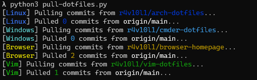

# Personal dotfiles
**My personal dotfiles**

### Cloning
Because this repository has [submodules](https://git-scm.com/book/en/v2/Git-Tools-Submodules), you need to specify a parameter to the git clone command ([?](http://git-scm.com/book/en/v2/Git-Tools-Submodules#_cloning_submodules)):
```bash
git clone --recurse-submodules https://github.com/r4v10l1/dotfiles
```
Check [SUBMODULES.md](https://github.com/r4v10l1/dotfiles/blob/main/SUBMODULES.md) for more info.

### Pulling the repositories
Once you have them downloaded, there might be changes to the submodules! And if you do a `git pull` on the dotfiles repository, you will not pull the submodules.  
To do this, use the `git submodules` command:
```bash
git submodule update --init --recursive         # Git command
```
You can also check [scripts](#scripts) for more information on how to do all of this more easily.

### Scripts
#### Python
Before using the python scripts make sure you have all the requirements installed with:
```bash
cd scripts/python
python3 -m pip install -r requirements.txt
```
The `pull-dotfiles.py` script you will pull all the latest commits from the origin of each submodule.  
To use it once you installed the requirements:
```bash
cd scripts/python
python3 pull-dotfiles.py
```



#### Bash
In my opinion the best way to automate all of the above (Although not as fancy and elavorated as the python way) is to use my `sync-dotfiles.sh` script.
Even if you did not use `--recurse-submodules` when cloning, you can use my bash script to:
- Start and get the submodules (Commit saved in the main repo)
- Doing checkout to the correct branches (main)
- Pulling all the submodules from origin/main

To use this script:
```bash
cd scripts
chmod +x sync-dotfiles.sh
./sync-dotfiles.sh
```

